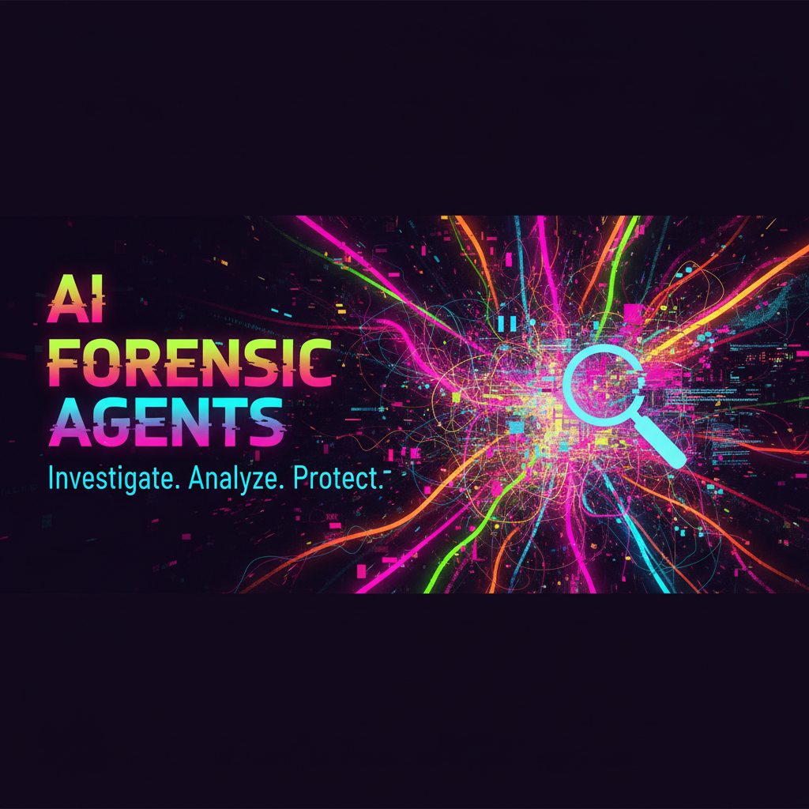

<!-- meta:og:description AI Forensic Agents — Human-managed investigative services and tools for analyzing, attributing, and remediating AI-caused damages. Epistemologically rigorous. Adversarially robust. Unhinged levels of accountability. -->

# 🔬🔥 AI FORENSIC AGENTS — MARKETING KIT 🔥🔬

### `ai-forensic-agents-mkgt`



---

[](#license)
[](#)
[](#)
[](#contributing)
[](#services-overview)
[](#)

---

## 📖 About

Okay bestie, let's unpack this because it's genuinely unhinged how little infrastructure exists for when AI systems absolutely obliterate people's lives and everyone just shrugs. **AI Forensic Agents** said "no more" and honestly? It's giving *accountability era*.

**AI Forensic Agents** is a **human-managed constellation of investigative services and diagnostic tools** purpose-built for the forensic analysis, causal attribution, and evidentiary documentation of **AI-caused damages** — and yes, we are dead serious beneath the day-glow exterior.

We operate at the intersection of **computational epistemology** and **applied algorithmic accountability**, deploying methodologies rooted in:

- 🧠 **Epistemological Framework Analysis** — Interrogating the knowledge-theoretic assumptions baked into AI systems that caused harm. What did the model "know"? What *could* it have known? We deconstruct the entire epistemic pipeline from training data provenance through inferential output, because the ontological commitments embedded in these systems are NOT neutral and that tea needs to be spilled forensically.

- 📊 **Stochastic Perturbation Analysis** — Systematically probing decision boundaries through controlled input perturbations to reconstruct the probabilistic fault surfaces that led to damaging outputs. We're literally reverse-engineering the chaos mathematics of how an AI ruined your day, your credit score, your medical diagnosis, or your entire livelihood. The variance decomposition goes crazy.

- 🛡️ **Adversarial Robustness Auditing** — Evaluating whether the AI system in question maintained adequate resilience against distributional shift, adversarial inputs, or edge-case scenarios that a reasonably designed system should have anticipated. If the model folded under conditions that were *foreseeable*? That's negligence, babe. We document it with mathematical precision.

- ⚖️ **Algorithmic Accountability Mapping** — Tracing the full sociotechnical dependency graph from model architecture decisions → training data curation → deployment context → harm manifestation. Every node in that causal DAG gets scrutinized. We produce accountability cartographies that would make a regulatory body weep with joy.

- 🔍 **Counterfactual Impact Estimation** — Leveraging causal inference frameworks (Pearlian do-calculus, potential outcomes, structural causal models) to establish what *would have happened* absent the AI system's intervention. This is the "but-for" causation analysis that litigation teams actually need, except we do it with statistical rigor that peer reviewers would respect.

This is **not** an automated tool that "audits AI" with another AI. That's recursive cope. **AI Forensic Agents** is a **human-managed service layer** — real investigators, real domain experts, real methodological frameworks — augmented by purpose-built diagnostic tooling. The humans are in the loop because the humans are THE loop. Period. No cap.

We exist because the **post-deployment harm surface** of contemporary AI systems is expanding faster than institutional oversight mechanisms can adapt, and somebody needs to be in the trenches doing the actual forensic epistemology when things go catastrophically wrong. That somebody is us. We ate and left no crumbs.

---

## 📦 Marketing Assets

This repository contains the official marketing kit assets for promoting AI Forensic Agents across paid, organic, and partnership channels.

| Asset | Path | Description |
|-------|------|-------------|
| 🖼️ **Static Ad Image** | `assets/ai-forensic-agents-banner.png` | Primary display advertisement banner — high-resolution, platform-optimized |
| 📝 **Ad Copy** | `copy/ad-copy-primary.md` | Primary advertising text with headline, body, and CTA variants |
| 📝 **Ad Copy Alternates** | `copy/ad-copy-variants/` | A/B test copy variants for segmented audience targeting |
| 🌐 **Landing Page Guidelines** | `guidelines/landing-page-spec.md` | Full specification for click-through landing page design, content hierarchy, and conversion architecture |
| 🎨 **Brand Guidelines** | `guidelines/brand-identity.md` | Color palette, typography, tone-of-voice reference, and logo usage rules |
| 📐 **Asset Templates** | `templates/` | Editable design templates (Figma links, SVG source files) |
| 📊 **Campaign Brief** | `briefs/campaign-brief-q1.md` | Strategic campaign overview, audience personas, KPIs, and channel allocation |

---

## 📐 Ad Specifications

### Static Display Image

| Parameter | Specification |
|-----------|--------------|
| **Dimensions** | `1800 × 1050 px` |
| **Aspect Ratio** | `12:7` (approximately 1.714:1) |
| **File Format** | PNG (lossless, 24-bit RGB) |
| **Color Space** | sRGB IEC61966-2.1 |
| **Max File Size** | 5 MB |
| **Safe Zone** | Minimum 60px inset from all edges for critical text/logo elements |
| **Background** | Dark-field preferred — optimized for feed-scroll contrast and visual arrest |

### Ad Copy — Text Paragraph

| Parameter | Specification |
|-----------|--------------|
| **Maximum Length** | **360 characters** (including spaces) |
| **Headline** | 40 characters max, action-oriented |
| **Body Text** | 280 characters max, value-proposition focused |
| **CTA (Call to Action)** | 40 characters max, high-urgency language |
| **Tone** | Authoritative yet accessible — "your PhD advisor who also has a fire TikTok" |
| **Required Elements** | Must reference: (1) human-managed investigation, (2) AI-caused damages, (3) clear next step |

### Landing Page Requirements

| Parameter | Specification |
|-----------|--------------|
| **Load Time** | < 2.5 seconds (Core Web Vitals compliant) |
| **Mobile Responsiveness** | Mandatory — mobile-first design |
| **Above-the-Fold Content** | Hero statement, single CTA button, trust indicators |
| **Form Fields** | Maximum 4 fields for initial lead capture (name, email, damage type, brief description) |
| **Social Proof Section** | Case study summaries, credential badges, methodology credibility markers |
| **Compliance** | GDPR/CCPA-compliant data collection with explicit consent toggles |
| **Analytics** | UTM parameter passthrough, conversion pixel placement, scroll-depth tracking |
| **SSL** | HTTPS required — no exceptions |

---

## 🔬 Services Overview

AI Forensic Agents provides **human-managed investigative services** across the full lifecycle of AI harm — from initial incident detection through evidentiary documentation suitable for regulatory filings, litigation support, and organizational remediation.

### 🕵️ Core Investigative Services

**1. Incident Triage & Preliminary Assessment**
> First-response forensic evaluation of alleged AI-caused harm. We determine whether the damage vector is attributable to an AI system, characterize the harm typology, and scope the full investigation. Think of it as the ER intake but for algorithmic violence. Speed is everything here and we move FAST.

**2. Causal Attribution Analysis**
> Deep-dive forensic reconstruction of the causal chain linking AI system behavior to documented damages. We employ structural causal modeling, counterfactual reasoning, and statistical fault isolation to establish attribution with evidentiary rigor. This is where the stochastic perturbation analysis hits different — we're literally mapping the probability manifold of "how did this system produce this specific harm."

**3. Model Behavior Reconstruction**
> Black-box and grey-box reverse engineering of AI system decision processes at the time of the damaging event. Through systematic probing, output analysis, and behavioral fingerprinting, we reconstruct a functional characterization of what the model did and why. Even when the deployer won't hand over model weights (and bestie, they never want to), we have methodologies.

**4. Data Provenance Investigation**
> Upstream forensic analysis of training data, fine-tuning data, and retrieval-augmented generation sources to identify whether data quality failures, representational harms in training corpora, or data poisoning contributed to the damaging output. The epistemological archaeology goes DEEP.

**5. Evidentiary Documentation & Expert Reporting**
> Production of forensic reports suitable for regulatory submission, litigation discovery, insurance claims, and organizational governance proceedings. Our reports are structured to withstand adversarial scrutiny — because opposing counsel WILL try to pick them apart, and we do not give them the satisfaction.

**6. Remediation Advisory**
> Post-investigation guidance on risk mitigation, system modification requirements, monitoring protocol design, and organizational process changes to prevent recurrence. We don't just diagnose — we prescribe. And the prescription is accountability with a side of robust governance frameworks.

### 🧰 Diagnostic Tooling

In addition to human-led investigation, we develop and maintain **open-source and proprietary diagnostic tools** that support forensic workflows:

- **Perturbation analysis engines** for systematic decision boundary mapping
- **Output consistency profilers** for detecting stochastic instability in AI responses
- **Causal graph construction utilities** for modeling sociotechnical harm pathways
- **Bias surface estimators** for quantifying differential impact across demographic strata
- **Temporal behavior drift detectors** for identifying when model behavior deviated from baseline

---

## 💥 Use Cases

Real talk — the range of AI-caused damages is *expanding at a velocity that should concern everyone*. Here are the categories of harm we investigate, and yes, every single one of these is happening right now in the wild:

### 🏥 Healthcare & Medical AI Failures
> AI diagnostic systems that misclassify conditions, triage algorithms that deprioritize patients based on proxy variables correlated with race or socioeconomic status, and clinical decision support tools that recommend inappropriate treatments. When an algorithm stands between a patient and correct care, the failure mode is literally life and death. We forensically reconstruct what went wrong and establish whether the system's epistemic limitations were known (or knowable) prior to deployment.

### 💰 Financial & Credit Scoring Harm
> Algorithmic credit denial, AI-driven lending discrimination, automated fraud detection systems that freeze legitimate accounts and destroy livelihoods, and robo-advisory tools that execute catastrophic portfolio decisions. The stochastic perturbation analysis is particularly devastating here — we can often demonstrate that nearly-identical applicants received wildly divergent outcomes based on features that serve as proxied protected characteristics. The math does not lie.

### 👤 Wrongful Identification & Surveillance
> Facial recognition misidentification leading to false arrest, AI-powered surveillance systems that disproportionately target marginalized communities, and biometric matching failures with life-altering consequences. We perform adversarial robustness audits on the identification systems involved and quantify the error rates across demographic subgroups. If the system was deployed knowing its failure rates were inequitable? That's our evidentiary goldmine.

### 📄 Employment & Hiring Discrimination
> AI resume screening tools that systematically filter out qualified candidates based on proxied protected characteristics, automated interview scoring systems with unvalidated psychometric claims, and workforce analytics platforms that generate discriminatory performance predictions. We reverse-engineer the screening logic and document the disparate impact with statistical rigor that regulators actually respond to.

### 🏠 Housing & Insurance Discrimination
> Algorithmic pricing models in insurance that encode geographic or demographic bias, AI-powered tenant screening that perpetuates housing discrimination, and automated property valuation systems that systematically undervalue properties in communities of color. The algorithmic accountability mapping on these cases is *chef's kiss* because the causal DAGs are so clearly traceable.

### 🗣️ Content & Reputation Harm
> AI content moderation systems that disproportionately silence specific communities, generative AI that produces defamatory synthetic content, recommendation algorithms that amplify harassment campaigns, and AI-generated content attributed to real individuals without consent. The epistemological framework analysis here is critical — we interrogate what the system's training data "taught" it about whose speech matters and whose doesn't.

### 🚗 Autonomous System Failures
> Self-driving vehicle incidents, autonomous drone operations causing property damage or injury, robotic system malfunctions in industrial or consumer contexts, and AI-controlled infrastructure failures. We reconstruct the decision-state timeline of the autonomous system leading up to the incident with forensic granularity.

### 📚 Educational AI Harm
> AI proctoring systems that falsely flag students for cheating (with documented racial bias in gaze-tracking), automated grading systems that penalize dialectal variation in language, and AI-powered educational recommendations that reinforce tracking and stratification. The counterfactual impact estimation is particularly powerful here — we can model what the student's trajectory would have looked like absent the AI's intervention.

---

## 🤝 Contributing

We are SO here for community contributions to the marketing kit. Whether you're a designer, copywriter, strategist, or just someone who has strong opinions about kerning (valid), we want to hear from you.

### How to Contribute

1. **Fork** this repository
2. **Create a feature branch** (`git checkout -b feature/your-contribution-name`)
3. **Make your changes** — follow the brand guidelines in `guidelines/brand-identity.md`
4. **Test all assets** — verify image dimensions, character counts, and spec compliance
5. **Commit with clear messages** (`git commit -m "Add: alternate ad copy for healthcare vertical"`)
6. **Push to your branch** (`git push origin feature/your-contribution-name`)
7. **Open a Pull Request** with a description of what you changed and why

### Contribution Guidelines

- All ad copy must adhere to the **360-character maximum** specification
- Image assets must be submitted at **1800 × 1050 px** in **PNG format**
- New copy variants should include a brief rationale for the messaging angle
- All contributions must align with the brand tone: **authoritative, accessible, and absolutely uncompromising on accountability**
- Please do not submit AI-generated marketing copy without disclosure — yes we see the irony, no we do not care, quality control is quality control
- Be respectful in all interactions — our Code of Conduct applies to all contributors

### Reporting Issues

Found a typo? Spec inconsistency? Asset that doesn't render correctly? Open an issue with the `bug` or `improvement` label and we'll get on it expeditiously.

---

## 📜 License

This project is licensed under the **MIT License**.

```
MIT License

Copyright (c) 2024 AI Forensic Agents

Permission is hereby granted, free of charge, to any person obtaining a copy
of this software and associated documentation files (the "Software"), to deal
in the Software without restriction, including without limitation the rights
to use, copy, modify, merge, publish, distribute, sublicense, and/or sell
copies of the Software, and to permit persons to whom the Software is
furnished to do so, subject to the following conditions:

The above copyright notice and this permission notice shall be included in all
copies or substantial portions of the Software.

THE SOFTWARE IS PROVIDED "AS IS", WITHOUT WARRANTY OF ANY KIND, EXPRESS OR
IMPLIED, INCLUDING BUT NOT LIMITED TO THE WARRANTIES OF MERCHANTABILITY,
FITNESS FOR A PARTICULAR PURPOSE AND NONINFRINGEMENT. IN NO EVENT SHALL THE
AUTHORS OR COPYRIGHT HOLDERS BE LIABLE FOR ANY CLAIM, DAMAGES OR OTHER
LIABILITY, WHETHER IN AN ACTION OF CONTRACT, TORT OR OTHERWISE, ARISING FROM,
OUT OF OR IN CONNECTION WITH THE SOFTWARE OR THE USE OR OTHER DEALINGS IN THE
SOFTWARE.
```

See [`LICENSE`](